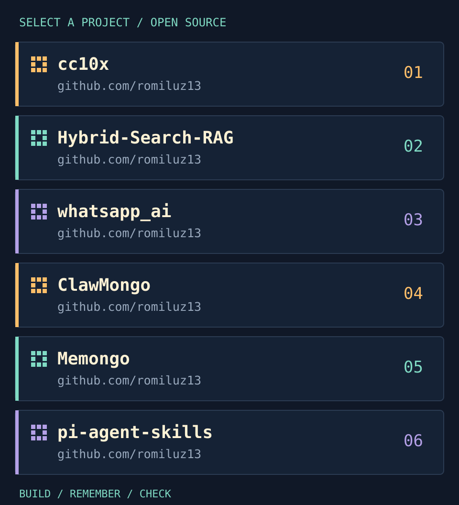

  

  <a href="https://github.com/romiluz13/cc10x">Execution</a> &nbsp; / &nbsp;
  <a href="https://github.com/romiluz13/jevmory">Memory</a> &nbsp; / &nbsp;
  <a href="https://github.com/romiluz13/llm-friendly-bench">Measurement</a>

I build open-source tools for coding agents, with a focus on the gap between what an agent claims and what the evidence shows.

## Start here

01. [cc10x](https://github.com/romiluz13/cc10x)
02. [Hybrid-Search-RAG](https://github.com/romiluz13/Hybrid-Search-RAG)
03. [whatsapp_ai](https://github.com/romiluz13/whatsapp_ai)
04. [ClawMongo](https://github.com/romiluz13/ClawMongo)
05. [Memongo](https://github.com/romiluz13/Memongo)
06. [pi-agent-skills](https://github.com/romiluz13/pi-agent-skills)

## What I want to measure

**Does a skill help on real tasks?** Does a green result satisfy the actual contract? Does a remembered fact still have support?

Same model, same tasks, one changed component - publishing prompts, checks and results, including the losses.

> Scripted checks test the harness. They are not a substitute for live-model evidence.

## MongoDB and retrieval

[Hybrid-Search-RAG](https://github.com/romiluz13/Hybrid-Search-RAG) and [Memongo](https://github.com/romiluz13/Memongo) - retrieval and persistent agent memory.

---

  <a href="https://www.linkedin.com/in/rom-iluz">LinkedIn</a> &nbsp; / &nbsp;
  <a href="mailto:rom@iluz.net">Email</a>

