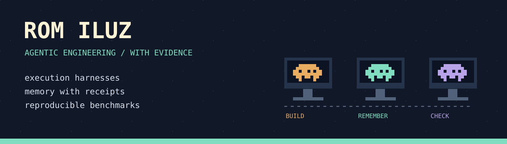

  

  <a href="https://github.com/romiluz13/cc10x">Execution</a> &nbsp; / &nbsp;
  <a href="https://github.com/romiluz13/jevmory">Memory</a> &nbsp; / &nbsp;
  <a href="https://github.com/romiluz13/llm-friendly-bench">Measurement</a>

I build open-source tools for coding agents, with a focus on the gap between what an agent claims and what the evidence shows.

## Start here

## MongoDB and retrieval

[Hybrid-Search-RAG](https://github.com/romiluz13/Hybrid-Search-RAG) and [Memongo](https://github.com/romiluz13/Memongo) - retrieval and persistent agent memory.

---

  <a href="https://www.linkedin.com/in/rom-iluz">LinkedIn</a> &nbsp; / &nbsp;
  <a href="mailto:rom@iluz.net">Email</a>

